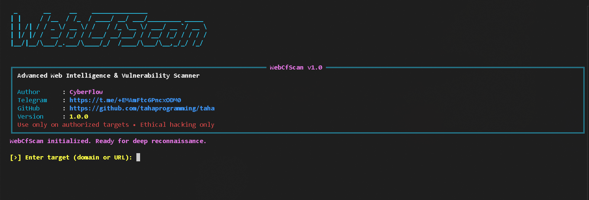
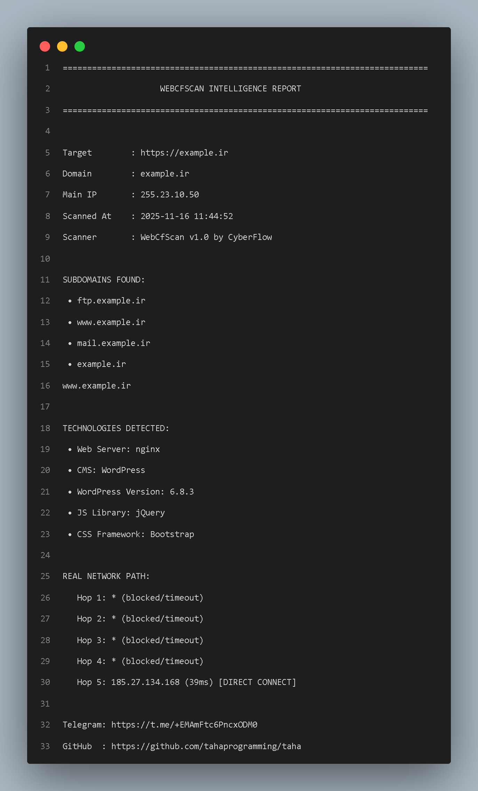

# **WebCfScan - Advanced Web Reconnaissance & Fingerprinting Tool🌐**

[](https://github.com/tahaprogramming/taha)
[](https://python.org)
[](https://opensource.org/licenses/Apache-2.0)
[](https://t.me/+EMAmFtc6PncxODM0)




> **⚠️Pure Intelligence, Zero Aggression⚠️**

> Fast • Accurate • Beautiful • 100% Recon-only


**``WebCfScan``** is a fast, pure-Python reconnaissance tool that identifies web technologies, versions, subdomains, and real network paths — all in a stunning terminal interface.

No payloads. No exploits. Just clean, passive intelligence gathering.

Ideal for bug bounty recon, pentest OSINT, and red team research.

---

### Features

- Technology & version fingerprinting
- Subdomain enumeration (crt.sh + light brute)
- Real network path discovery (TTL-based)
- Gorgeous `rich`-powered UI
- Automatic detailed reports

---

### Report Intelligence

---

### Requirements
```python
rich>=13.7.0
pyfiglet>=1.0.2
requests>=2.31.0
```

### Installation
```bash
> git clone https://github.com/tahaprogramming/WebCFScan.git
> cd WebCFScan
> pip install -r requirements.txt
> python webcfscan.py
```
> **Tip: Run with sudo for accurate network path detection ⚠️**

> ### **Author**
> **```CyberFlow```**
>
> **```Telegram```** → https://t.me/+EMAmFtc6PncxODM0
>
> **```WebCfScan```** — Recon, redefined.

---

### License
``Licensed under the Apache License 2.0
Copyright © 2025 CyberFlow``
